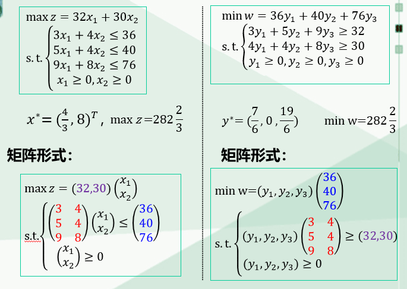
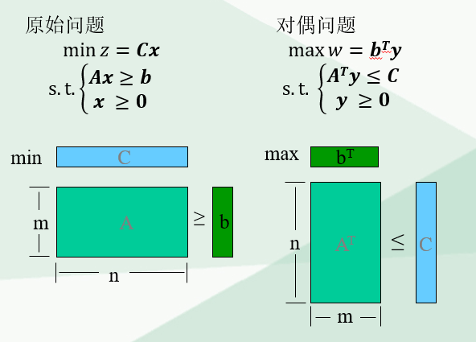
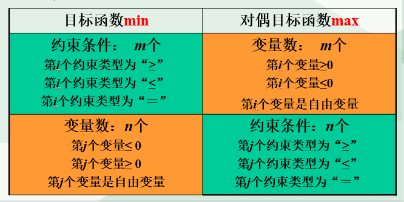
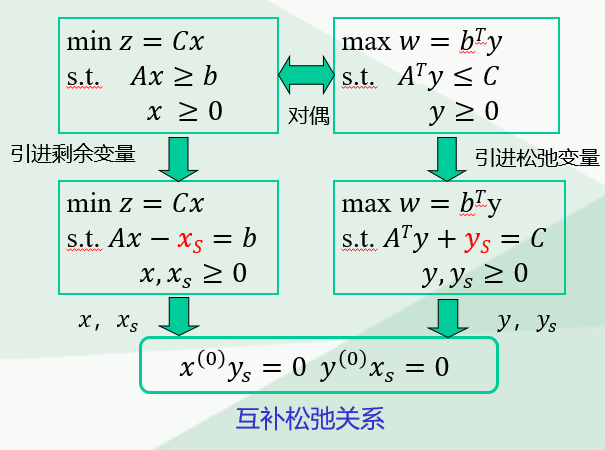
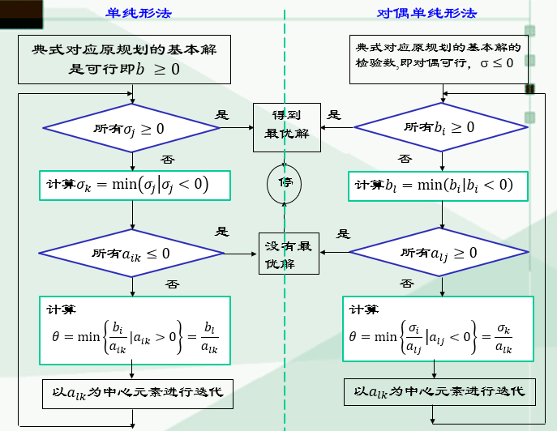

# 对偶线性规划

## 对偶线性规划的概念

将如何生产使得利润最大问题转为如何出租机器使得最少租金不低于设备自行生产所获得的利润问题。最终得到对称的线性规划问题：

图解

## 非一般形式的对偶问题写法

处理方法：对变量和约束进行转化

1. 如果有$\ge$约束，则左右同乘-1，转化为$\le$约束
2. 如果有=约束，则转换为一个$\ge$约束加一个$\le$约束
3. 如果有无符号限制的变量，就用两个符号相减表示：$x_i=x'_i-x''_i(x'_i,x''_i\ge 0)$

## 对偶问题性质

1. 对偶问题的对偶是原问题
2. 弱对偶定理——有界性定理：若$x^{(0)}$是原问题的可行解，$y^{(0)}$是对偶问题的可行解，则$Cx^{(0)}\ge b^Ty^{(0)}$，证明：
   $$
   y^{(0)}A\ge C \And Ax^{(0)}\ge b \implies Cx^{(0)}\ge y^{(0)}Ax^{(0)}\ge y^{(0)}b
   $$
   - 对偶问题种，任意一个可行解，都产生了另一个问题的目标函数的界。
   - 若原问题和对偶问题都有可行解,则它们都有最优解
   - 若互为对偶问题中任意一个有可行解，但无最优解，则另一个就无可行解
3. 最优性定理：如果原问题的可行解和对偶问题的可行解的目标函数值相等（$Cx^{(0)}=b^Ty^{(0)}$），则$x^{(0)}$和$y^{(0)}$是两个问题的最优解
4. 强对偶定理：如果原问题有最优解，那么对偶问题也有最优解，而且目标函数值相等
5. 互补松弛定理：$x^{(0)}$和$y^{(0)}$是最优解的充要条件是$y^{(0)}x_s=0, y_sx^{(0)}=0$，其中$x_s$是原问题的剩余变量，$y_s$是对偶问题的松弛变量
   
6. 原问题的检验数对应对偶问题的一个基本解

## 对偶单纯形法

