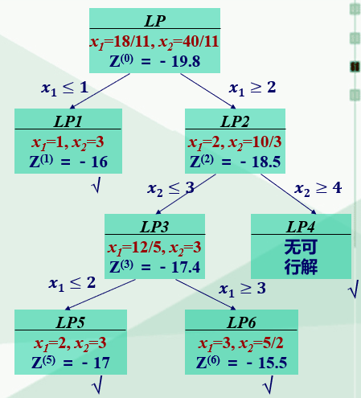
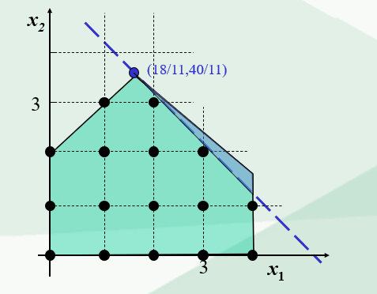

# 整数规划

## 模型

$$
max z=\sum_{j=1}^{n}{c_jx_j} \\
s.t.
\begin{cases}
    \sum_{j=1}{n}{a_{ij}x_j}=b_i, i\in [1, m] \\
    x_j \ge 0, j \in [1, n]
\end{cases}
$$

- 纯整数规划：所有决策变量要求取非负整数
- 全整数规划：所有决策变量要求取非负整数，系数$a_{ij}$和常数$b_i$也要求取整数
- 混合整数规划：只有一部分决策变量要求取非负整数，另一部分可以取非负实数
- 0-1整数规划：所有决策变量要求只能取0或1

松弛问题或伴随问题：不考虑整数约束，得到的线性规划问题

解法
- 图解法
- 完全枚举法
- 分支界定法
- 割平面
- 隐枚举法和匈牙利法（0-1整数规划）

## 分支界定法

### 基本思路
1. 解整数规划（IP）的松弛问题（LP），得到以下情况
   1. LP没有可行解，IP也没有，停止计算
   2. LP有最优解，并符合IP整数条件，停止计算
   3. LP有最优解，但不符合IP整数条件
2. 以IP获得的$z_1$作为上界，再用观察法找到一个整数可行解的目标函数值$z_2$作为下界
3. 任选一个不符合整数条件的$x$，构造以下两个约束条件，将两个约束条件分别加入LP得到LP1和LP2
   $$x_r\le \lfloor b_r \rfloor \And x_r \ge \lfloor b_r \rfloor +1$$
4. 剪枝：各分支目标函数中有小于$z_2$的剪掉

### 列子

## 割平面法

### 原理

在可行域中割去部分非整数解，剩余部分有一个极点，正好是整数最优解

### 割平面生成方法

### 计算步骤

1. 用单纯形法求解IP对应的松弛问题（LP）：
   1. LP没有可行解，IP也没有，停止计算
   2. LP有最优解，并符合IP整数条件，停止计算
   3. LP有最优解，但不符合IP整数条件
2. 

## 指派问题