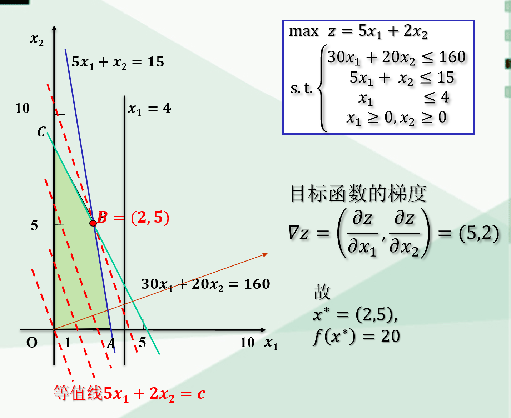

# 线性规划

## 图解法

## 标准形式

$$
max(min) \ z = c_1x_1+c_2x_2+\cdots +c_nx_n \\
s.t. 
\begin{cases}
        a_{11}x_1+a_{12}x_2+&\cdots +a_1nx_n=b_1 \\
        a_{21}x_1+
        a_{22}x_2+&\cdots +a_{2n}x_n=b_1 \\
        &\cdots \\
        a_{n1}x_1+a_{n2}x_2+&\cdots +a_{nn}x_n=b_1 
\end{cases}
$$

### 非标准问题标准化

1. 线性不等式，非负松弛变量：$x_{n+i}$，非负剩余变量：$x_{n+k}$
   $$
   \sum_{j=1}^na_{ij}x_j \le b_i \Rightarrow \sum_{j=1}^na_{ij}x_j+x_{n+i}=b_i \\
   \sum_{j=1}^na_{ij}x_j \ge b_i \Rightarrow \sum_{j=1}^na_{ij}x_j-x_{n+k}=b_k
   $$
2. 非负变量与符号不受限的变量：引进非负变量$x_{i1}, x_{i2}$令$x_i=x_{i1}-x_{i2}$

### 标准型的解

对于一个标准型：

$$
min\ z = Cx \\
s.t.
\begin{cases}
        Ax &=b \\
        x &\ge 0
\end{cases}
$$

A为$m\times n$阶矩阵，假定满足$m \le n$

令$A=(B,N),\ x=(x_B, x_N)$，得：

$$
\begin{aligned}
Ax=b &\rightarrow Bx_B+Nx_N=b \\
&\rightarrow x_B+B^{-1}Nx_N=B^{-1}b \\
&\xrightarrow{x_N=0} x=
\begin{pmatrix}
    B^{-1}b \\
    0
\end{pmatrix}
\end{aligned}
$$

$\it{B}$是约束矩阵$\it{A}$的一个$m$阶满秩的子矩阵

- $\it{B}$为一个**基**
- $\it{B}$中线性无关的列向量称为**基向量**
- 变量$x$中与之对应的分量称为**基变量**
- $x=\begin{pmatrix} B^{-1}b \\ 0 \end{pmatrix}$是$\it{B}$的**基本解**
- 当$B^{-1}b \ge 0$，则基本解为**基本可行解**，对应$\it{B}$为可行基

## 单纯形法

### 1. 确定初始的基本可行解

$$
Ax=(B,N)\begin{pmatrix}
    x_B \\
    x_N
\end{pmatrix}
=Bx_B+Nx_N=b
$$

若令所有非基变量$x_N=0$，则基变量$x_B=B^{-1}b$，得到初始的基本可行解

$$
x=
\begin{pmatrix}
    B^{-1}b \\
    0
\end{pmatrix}
$$

如何保证$\it{B}$矩阵每列一定线性无关？

在标准化过程中设法得到一个$m$阶单位矩阵$\it{I_m}$作为初始可行基$\it{B}$

### 2. 判断现行的基本可行解是否最优

在求得基本可行解之后，目标函数值为：

$$
z=Cx=(C_B,C_N)
\begin{pmatrix}
    B^{-1}b \\
    0
\end{pmatrix}
=C_BB^{-1}b
$$

如何判定$C_BB^{-1}b$已经达到最小值？

在标准形式经过消元迭代后有：

$$
\begin{cases}
    x_1=b'_1-\sum_{j=m+1}^n a'_{1j} x_j \\
    \cdots \\
    x_m=b'_m-\sum_{j=m+1}^n a'_{mj} x_j
\end{cases}
$$

$x_1,\cdots,x_m$为基变量，$x_{m+1},\cdots,x_n$为非基变量，代入目标函数得：

$$
\begin{aligned}
z&=\sum_{i=1}^mc_1(b'_i-\sum_{j=m+1}^na'_{ij}x_j)+\sum_{i=m+1}^nc_ix_i\\
&=\sum_{i=1}^mc_1b'_i+\sum_{j=m+1}^n(c_j-\sum_{i=1}^mc_ia'_{ij})x_j \\
&\Longleftrightarrow C_BB^{-1}b+(C_N-C_BB^{-1}N)x_j
\end{aligned}
$$

标准形式经过消元迭代相当于：

$$
(B,N)
\begin{pmatrix}
    x_B \\
    x_N
\end{pmatrix}=b \implies 
(I,B^{-1}N)\begin{pmatrix}
    x_B \\
    x_N
\end{pmatrix}=B^{-1}b \\

B^{-1}N = [a'_{ij}]_{m, n-m} \\
B^{-1}b = [b'_i]_m
$$

令$z_0=\sum_{i=1}^mc_ia'_{ij},\sigma_j=c_j-\sum_{i=1}^mc_ia'_{ij}$，则有$z=z_0+\sum_{j=m+1}^n\sigma_jx_j$，$\sigma_j$为检验数

当$x^*=(b_1^*,\cdots,b_m^*,0,\cdots,o)^T$是基$\it{B}$的一个基本可行解，判定定理：

$$
\begin{cases}
    \forall j \in [m+1, n] \ \sigma_j \ge 0 
    \begin{cases}
        \forall \sigma_{m+k}\ge 0(k\ge 1) \implies 线性规划问题的最优解\\
        \exist \sigma_{m+k}=0(k\ge 1) \implies 线性规划问题有无穷多最优解
    \end{cases} \\
    \exist j \in [m+1, n] \ \sigma_j < 0 \And \forall i\in [1,m] \ a'_{i,j} \le 0 \implies 解无界
\end{cases}
$$

PS：当$x_i$为0的时候，代表$x_i$取得了最小值，如果$\sigma_{i}<0$说明$x_i$数值变大时可以使得$z$获得更小的值，因此最优解一定是$\sigma_{i}\ge 0$

### 3. 基本可行解的改进——基变换

当现行解不是最优解时，一定$\exist j \in [m+1, n] \ \sigma_j < 0$

- 入基变量：选择$\min_{j}\{ \sigma_{j}|\sigma_{j} < 0 \} =\sigma_{k}$对应的$x_k$。

- 离基变量：确定入基变量$x_k$后，选择$\min_{i}\{\frac{b'_i}{a'_{ik}}|a'_{ik}>0\}=\frac{b'_l}{a'_{lk}}=\theta$对应的$x_l$。

### 用初等变换求改进了的基本可行解——旋转变换

通过矩阵变换，交换入基变量和离基变量对应的矩阵列，例子：

## 表格单纯形法

单纯形表如下：

例子：

在求解极小(大)化的线性规划问题过程中，若某单纯形表的检验行存在某个小(大)于零的检验数，但是该检验数所对应的非基变量的系数列向量的全部系数都为负数或零，则该线性规划问题无最优解。

## 借助人工变量求初始的基本解

基本思路：添加m个人工变量$x_(n+i)(i\in[1, m])$在系数矩阵，此时得到了一个构造出来的基本可行解$x_0=(0,0,\cdots,0,b_1, b_2,\cdots, b_m)^T$，从这个基本解出发寻找解，这个解必须使得$x_(n+i)(i\in[1, m])$都为0。

### 大M法

添加在系数矩阵添加人工变量的同时，将人工变量乘以M加入目标函数中，如：

$$
\max z = x_1+2x_2 \\
\begin{cases}
    x_1+x_2-x_3=2 \\
    -x_1+x_2-x_4=1\\
    x_2+x_5=3\\
    x_j\ge 0, j \in [1,5]
\end{cases} \\
\Downarrow \\
\max z = x_1-2x_2+Mx_6+Mx_7\\
\begin{cases}
    x_1+x_2-x_3+x_6=2 \\
    -x_1+x_2-x_4+x_7=1\\
    x_2+x_5=3\\
    x_j\ge 0, j \in [1,7]
\end{cases}
$$

如果在大M法的最优基变量中仍然含义人工变量，那么此线性规划无解

### 两阶段法

1. 先使得目标函数中所有人工变量之和最小化，如果不能使得每个人工变量都为0，说明此问题无解

$$
\max z = x_1+2x_2 \\
\begin{cases}
    x_1+x_2-x_3=2 \\
    -x_1+x_2-x_4=1\\
    x_2+x_5=3\\
    x_j\ge 0, j \in [1,5]
\end{cases} \\
\Downarrow \\
\max z = x_6+x_7\\
\begin{cases}
    x_1+x_2-x_3+x_6=2 \\
    -x_1+x_2-x_4+x_7=1\\
    x_2+x_5=3\\
    x_j\ge 0, j \in [1,7]
\end{cases}
$$

2. 在第一步完成之后，去除所有人工变量，将目标函数还原，继续求解

## 基本概念

1. 凸集：$K$是$n$维欧式空间的一个点集，任意两点$x_1,x_2\in K$的连线上的一切点$\alpha x_1+(1-\alpha)x_2\in K$
2. 凸组合：
